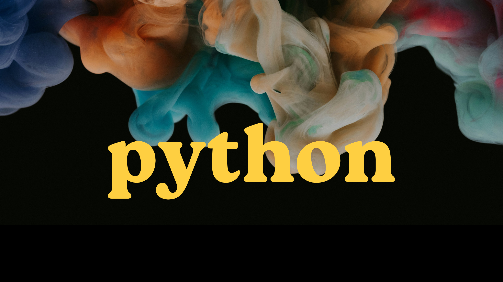

# Curso de Python para Principiantes

¡Bienvenidos al material del curso de Python para principiantes! Este repositorio contiene recursos y materiales para aprender Python desde cero, diseñado especialmente para aquellos que están dando sus primeros pasos en la programación.

## Objetivo del Curso

El objetivo de este curso es proporcionar una introducción al lenguaje de programación Python, abordando desde los conceptos básicos hasta temas más avanzados, de una manera accesible y sencilla. 
Al finalizar el curso, tendremos una comprensión sólida de los fundamentos de Python y estaremos preparados para abordar proyectos más avanzados.

## Contenido del Curso

El curso está estructurado en varias secciones, que cubren diferentes aspectos del lenguaje Python:

1. **Comenzar con Python**: Conceptos básicos, instalación y configuración del entorno de desarrollo, entrada y salida de datos con ¡Hola mundo!.
2. **Tipos de Datos y Operadores**: Variables, tipos de datos básicos, operadores y expresiones.
3. **Estructuras de Control**: Condicionales, bucles y manejo de excepciones.
4. **Funciones y Módulos**: Definición de funciones, parámetros, ámbito de variables y uso de módulos.
5. **Estructuras de Datos**: Listas, tuplas, conjuntos y diccionarios.
6. **Programación Orientada a Objetos**: Clases, objetos, herencia, polimorfismo y encapsulamiento.
7. **Manipulación de Archivos**: Lectura y escritura de archivos en Python. (En desarrollo todavía)
8. **Introducción a Bibliotecas Populares**: Breve introducción a bibliotecas como NumPy, Pandas y Matplotlib. (En desarrollo todavía...)

Cada sección del curso incluye ejemplos de código y ejercicios prácticos para reforzar los conceptos aprendidos.

## ¿Cómo Usar Este Repositorio?

Puedes clonar este repositorio para acceder a todos los materiales del curso. Cada sección se encuentra organizada en su propio directorio, con ejemplos de código. 

Si eres un principiante absoluto, te recomiendo seguir el curso en orden, comenzando por la sección "Comenzar con Python". Si ya tienes experiencia previa en programación, puedes saltar a las secciones que más te interesen.

¡Espero que disfrutes aprendiendo Python tanto como yo :) !

## Contribuir

Si encuentras errores, tienes sugerencias de mejoras o deseas contribuir con nuevos materiales al curso, ¡no dudes en abrir un issue o enviar un pull request! Tu contribución es bienvenida y ayudará a mejorar la experiencia de aprendizaje para todos.

## Agradecimientos

Este curso está creado con entusiasmo por [bitonobit](https://github.com/bitonobit). Agradezco especialmente a todos los recursos gratuitos que me facilitaron la creación de este repositorio.

Happy coding! 🐍✨
